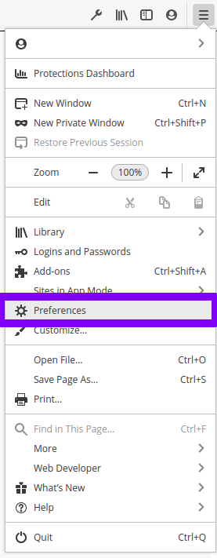
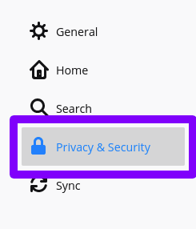
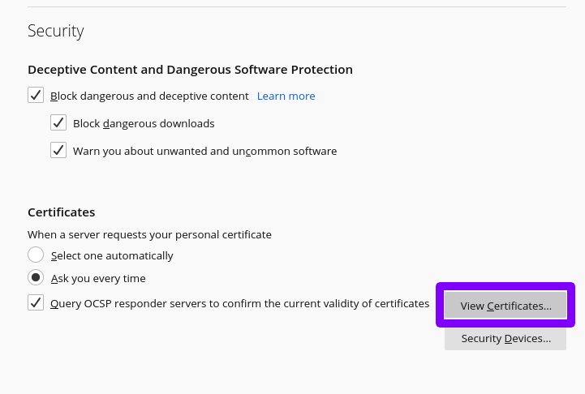
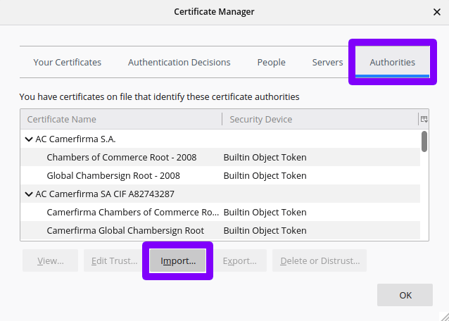

# Import CA into Firefox

First, open the menu at the top right of Firefox and click "Preferences". This will open up a new tab with all of Firefox's preferences available.

On the left side of the Preferences screen, click on "Privacy & Security".

Scroll to the bottom and click the button that says "View Certificates...". This will open a modal.

In the modal, switch to the "Authorities" tab. Then click the "Import..." button.

Select the file at `$DEVCA_HOME/ca/cert.pem` and import it.

That's it! Firefox should now trust any certificates generated by `devca`. Note that if you run the `regen` command, you will have to follow these steps again with the new CA certificate.